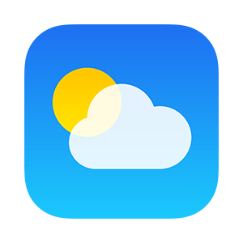

# Project: Weather App

In this project, as a way of practicing using `Promises` in making `API requests`, i developed a simple weather app using JavaScript, HTML & CSS!

<!--
*** Thanks for checking out this README Template. If you have a suggestion that would
*** make this better, please fork the repo and create a pull request or simply open
*** an issue with the tag "enhancement".
*** Thanks again! Now go create something AMAZING! :D
-->

<!-- PROJECT SHIELDS -->
<!--
*** I'm using markdown "reference style" links for readability.
*** Reference links are enclosed in brackets [ ] instead of parentheses ( ).
*** See the bottom of this document for the declaration of the reference variables
*** for contributors-url, forks-url, etc. This is an optional, concise syntax you may use.
*** https://www.markdownguide.org/basic-syntax/#reference-style-links
-->
[![Contributors][contributors-shield]][contributors-url]
[![Forks][forks-shield]][forks-url]
[![Stargazers][stars-shield]][stars-url]
[![Issues][issues-shield]][issues-url]

<!-- PROJECT LOGO -->
<br />
<p align="center">
  <a href="https://github.com/PhillipUg/weather-app">
    
  </a>

  <h1 align="center">Weather App</h1>

  <p align="center">
    <a href="https://phillipug.github.io/weather-app/">View Demo</a>
    ·
    <a href="https://github.com/PhillipUg/weather-app/issues">Report Bug</a>
    ·
    <a href="https://github.com/PhillipUg/weather-app/issues">Request Feature</a>
  </p>
</p>

<!-- TABLE OF CONTENTS -->
## Table of Contents

* [About the Project](#about-the-project)
* [Use Locally](#local-usage)
  * [Built With](#built-with)
* [Live Version](#live-version)
* [Contact](#contact)
* [Acknowledgements](#acknowledgements)
* [License](#license)

<br>
<br>
<!-- ABOUT THE PROJECT -->

## About The Project

This project's purpose is to practice Javascript concepts like Promises, Async/Await, Dom Manipulation, modularization among others.

* On first load, the app requests for the user's current location, if permission is granted. The app will diplay the weather at the user's geolocation.

* User is able to search for the weather of any city in the world by typing the city name i the search bar and pressing enter or the search button.

* User is able to toggle between showing temperature in either `Celsius` or `Fahrenheit` units.

![Product Name Screen Shot][product-screenshot]
<br>
<br>
<!-- ![Product Name Screen Shot][product-screenshot2] -->

<!-- ABOUT THE PROJECT -->
## Local Usage

To use this app locally, this is what you need to:

* [Download](https://github.com/PhillipUg/weather-app/archive/master.zip) or clone this repo:
  - Clone with SSH:
  ```
    git@github.com:PhillipUg/weather-app.git
  ```
  - Clone with HTTPS
  ```
    https://github.com/PhillipUg/weather-app.git
  ```
* `cd` into the downloaded folder and run `npm install`
* then, run `npm run start`.

### Built With
This project was built using these technologies.
* HTML
* CSS
* JavaScript
* Webpack
* Chrome Dev Tools

## Live Version
To try it live [click here](https://phillipug.github.io/weather-app/)

<!-- CONTACT -->

## Contact

👤 **Phillip Musiime**

- LinkedIn: [Phillip Musiime](https://www.linkedin.com/in/phillip-musiime/)
- GitHub: [PhillipUg](https://github.com/PhillipUg)
- Twitter: [@Phillip_Ug](https://twitter.com/Phillip_Ug)
- E-mail: phillipmusiime@gmail.com


<!-- ACKNOWLEDGEMENTS -->
## Acknowledgements
* [Microverse](https://www.microverse.org/)

<!-- MARKDOWN LINKS & IMAGES -->
<!-- https://www.markdownguide.org/basic-syntax/#reference-style-links -->
[contributors-shield]: https://img.shields.io/github/contributors/PhillipUg/weather-app.svg?style=flat-square
[contributors-url]: https://github.com/PhillipUg/weather-app/graphs/contributors
[forks-shield]: https://img.shields.io/github/forks/PhillipUg/weather-app.svg?style=flat-square
[forks-url]: https://github.com/PhillipUg/weather-app/network/members
[stars-shield]: https://img.shields.io/github/stars/PhillipUg/weather-app.svg?style=flat-square
[stars-url]: https://github.com/PhillipUg/weather-app/stargazers
[issues-shield]: https://img.shields.io/github/issues/PhillipUg/weather-app.svg?style=flat-square
[issues-url]: https://github.com/PhillipUg/weather-app/issues
[product-screenshot]: dist/images/gif2.gif
<!-- [product-screenshot2]: dist/images/page2.png -->


## 📝 License

This project is [MIT](https://opensource.org/licenses/MIT) licensed.